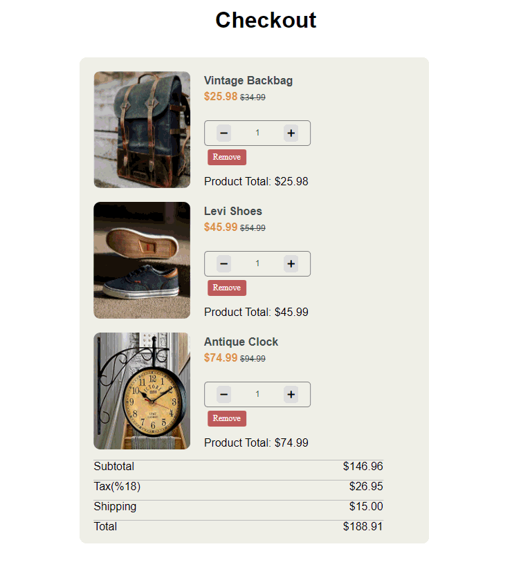

<!-- Please update value in the {}  -->

<p align="center">
  
  
  
  
  
  
</p>

<h1 align="center">🛒 Javascript-Shopping-Cart-Logic</h1>

<p align="center">
🛒 Interactive shopping cart application built with Vanilla JavaScript. Demonstrates advanced DOM manipulation using Event Delegation (Capturing/Bubbling), real-time pricing calculations, and Web Storage API integration.
</p>

<div align="center">
  <h3>
    <a href="https://umitarat-dev.github.io/Javascript-Shopping-Cart-Logic/">
      🖥️ Live Demo
    </a>
     | 
    <a href="https://github.com/umitarat-dev/Javascript-Shopping-Cart-Logic.git">
      📂 Repository
    </a>
 
  </h3>
</div>

<p align="center">
  <a href="https://umitarat-dev.github.io/Javascript-Shopping-Cart-Logic/">
    
  </a>
</p>

<!-- TABLE OF CONTENTS -->

## Navigation

- [✨ Overview](#-overview)
- [📖 Description](#-description)
- [🚀 Features](#-features)
- [🗂️ Project Skeleton](#-project-skeleton)
- [🛠️ Built With](#-built-with)
- [⚡ How To Use](#-how-to-use)
- [📌 About This Project](#-about-this-project)
- [📬 Contact Information](#-contact-information)

<!-- OVERVIEW -->

## ✨ Overview

This project is a **shopping cart (checkout) application** built using **vanilla JavaScript**, without any frameworks or libraries.

It demonstrates how to manage cart state, update the UI dynamically, and handle user interactions such as adding, removing, and updating product quantities.

## 📖 Description

The JavaScript Shopping Cart allows users to:
- Add products to the cart
- Increase or decrease item quantities
- Remove items from the cart
- See real-time updates of subtotal and total prices

The project focuses on **DOM manipulation**, **event handling**, and **clean JavaScript logic**, making it a solid example of core frontend fundamentals.


## 🚀 Features

- ➕ Add products to the shopping cart
- ➖ Increase / decrease product quantity
- ❌ Remove items from the cart
- 💰 Real-time price calculation
- 🔄 Dynamic DOM updates
- 📱 Responsive layout
- 🧠 Clean and readable vanilla JavaScript logic


## 🗂️ Project Skeleton

```
.
 │
 |-readme.md   
 │
 ├─ index.html
 │   
 ├─ css/
 │   └─ style.css
 │   
 ├─ app.js
 │   
 ├─ img/ │   
```

## 🛠️ Built With

- [JavaScript (ES6)](https://developer.mozilla.org/en-US/docs/Web/JavaScript)
- [HTML5](https://developer.mozilla.org/en-US/docs/Web/HTML)
- [CSS3](https://developer.mozilla.org/en-US/docs/Web/CSS)
- [GitHub Pages](https://pages.github.com/)

## ⚡ How To Use

```bash
# Clone this repository
git clone https://github.com/umitarat-dev/Javascript-Shopping-Cart-Logic.git

# Open index.html in your browser
```

## 📌 About This Project
This project was created to practice and demonstrate:
- Core JavaScript fundamentals
- DOM manipulation and event handling
- Shopping cart logic (state management)
- Dynamic UI updates without frameworks
- Building interactive frontend applications using pure JavaScript

It serves as a strong foundation before moving on to frameworks like React.


## 📬 Contact Information

I am always open to discussing new projects, creative ideas, or opportunities to be part of your visions.

* **LinkedIn:** [linkedin.com/in/umit-arat](https://www.linkedin.com/in/umit-arat/)
* **Email:** [umitarat8098@gmail.com](mailto:umitarat8098@gmail.com)
* **GitHub:** [github.com/umitarat-dev](https://github.com/umitarat-dev) (Current Workspace)
